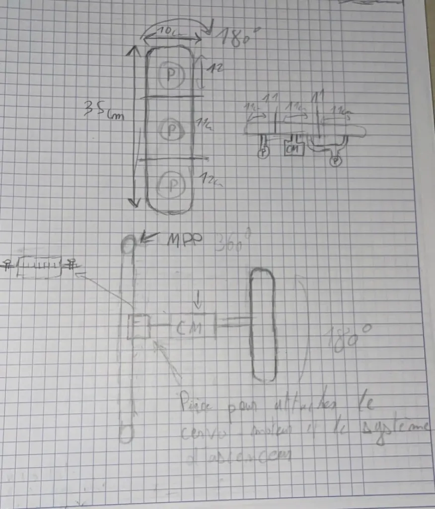

# Realisation du schema de l'actionneur
## Matériels nécessaires : 
- 1 cervo-moteur 
- 2 pompes 
- 1 moteur stepper
- 1 courroie

## Idées : 
### Prendre 3 cartons en une fois avec les pompes, tourner le support des pompes selon quel construction on doit faire et les placer. 
### 