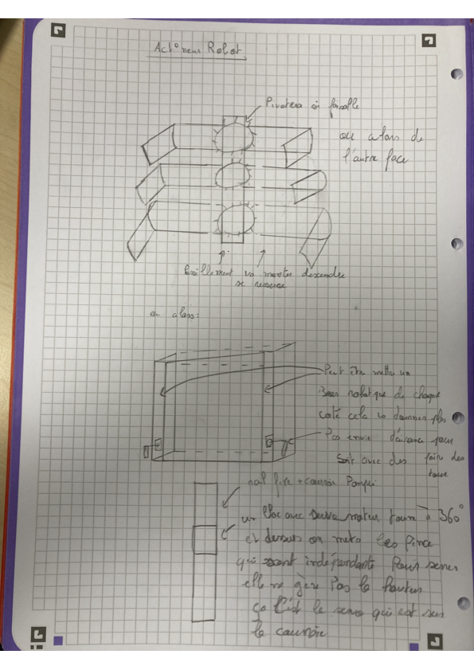

# 2026-10-09 : Conception de l'actionneur version final avant la modélisation:
---

a séance a débuté par une analyse de l'environnement de jeu de l'édition 2027.
⚬	Nous avons utilisé un simulateur 3D en ligne (visible dans le fichier Capture d’écran 2026-10-09 à 09.47.34.png) pour visualiser la table, les zones de départ et l'agencement des éléments de jeu.
### 
⚬	Afin de bien cibler nos actions et d'éviter les erreurs, nous avons réétudié le règlement officiel "Eurobot2027_Rules_FR.pdf" (comme le montre le fichier Capture d’écran 2026-10-09 à 09.52.19.png). Nous nous sommes concentrés particulièrement sur la figure 6 détaillant le plan de construction du château avec les blocs.
2. Idéation et conception de l'actionneur
### 
Pour répondre aux défis imposés par le terrain, la deuxième partie de la séance a été consacrée au brainstorming sur le système mécanique du robot. Plusieurs concepts ont été dessinés et documentés sous le titre "Actionneur Robot". Voici les trois idées principales qui ont émergé :
⚬	Concept A (Mécanisme central) : Un système de préhension capable de se resserrer pour attraper les objets, de monter et descendre, avec l'idée d'ajouter un pivot ("pivotera si faisable") ou d'agir depuis "l'autre face".
⚬	Concept B (Bras latéraux) : Une structure en forme de boîte proposant d'intégrer un bras robotique de chaque côté. Cette configuration aurait pour but de donner davantage d'aisance au robot pour effectuer des rotations.
⚬	Concept C (Rail et courroie - Piste privilégiée) : L'utilisation d'un rail fixe couplé à une courroie. Le concept repose sur un bloc équipé d'un servomoteur capable de tourner à 360°, sur lequel reposent des pinces indépendantes. L'avantage de ce système est de séparer les efforts : les pinces gèrent uniquement le serrage, tandis que la hauteur n'est pas gérée par les pinces mais par un système sur la courroie.
3. Choix des composants et motorisation de l'actionneur
Pour donner vie à notre concept de préhension sur rail (Concept C), nous avons défini la nomenclature des moteurs nécessaires. Il nous faudra au total 6 moteurs, avec des rôles bien distincts pour séparer les efforts :
⚬	Élévation (2 moteurs pas à pas) : Nous utiliserons deux moteurs pas à pas dont le rôle exclusif sera de faire monter et descendre le système via la poulie et la courroie sur le rail fixe.
⚬	Rotation et Préhension (4 servomoteurs) : Ces moteurs seront embarqués sur le bloc mobile et serviront à manipuler les objets :
⚬	Faire pivoter le bloc pour orienter les pièces.
⚬	Serrer les pinces pour attraper les éléments de jeu de façon indépendante.
Bilan de la séance :
Nous avons une vision claire des objectifs (manipulation et empilage pour le château) et nous avons posé des bases mécaniques solides pour l'actionneur. La prochaine étape sera de commencer à modéliser ce système pour intégrer les 6 moteurs.
