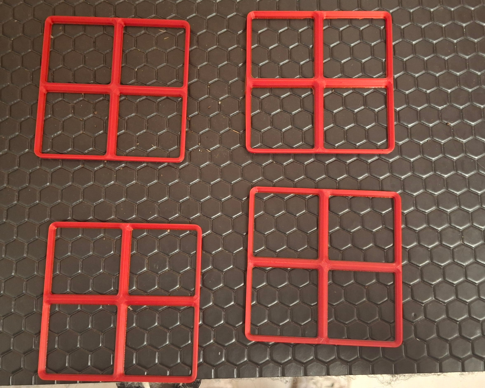

# 2026-10-07 : Déployement de la documentation PAMI v1.0

**Type de séance :** Session de travail · **Durée :** <code style="color: blue;">3h (18h-21h)</code>

## Réalisé durant la scéance :

### Fin de défveloppement et déployement de la documentation PAMI :

J'ai terminé la page de documentation des PAMI à l'intention des premières années. Bien que le détail des composants soit encore manquant, le principal y est présent pour bien débuter.

[Lien vers la documentation PAMI](https://unimakers.fr/CDR-2027/Documentation/Doc%20PAMI.html)

### Impression de bases Gridfinity pour la servante :

Dans le but de mieux ranger les outils dans la servante (et de virer définitivement la mousse), j'ai commencé à imprimer une base Gridfinity (non sans échecs de la part des imprimantes).

## Conclusion de la scéance :

Nous avons terminé par une réunion à propos de l'organisation des équipes, l'intégrartion progressive des premières années et la question des sponsorts. 

## A faire lors de la prochaine scéance :

| Type de tâche | Description | Priorité |
|---------------|-------------|----------|
| Conception | Brainstorm sur la conception mécanique et stratégique des PAMI | 1 |
| Rangement | Terminer le système Gridfinity pour la servante | 2 |
| Conception | Brainstorm sur la nature du Graal | 3 |