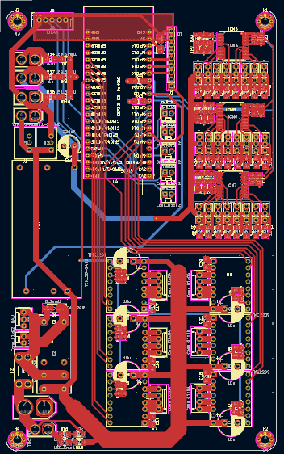

# contacte sponsors

j'ai une liste d'entreprise que j'avais faite avant et j'appelle les entreprises une a une.

voici ma trame a suivre pour les appelles:
- bonjour vous etes l'entreprise .......
nous sommes une association étudiante de robotique basé sur amiens nous participons a des compétition internationale de robotique rassemblant des centaines de jeunes.
notre objectif est d'aprendre l'éléctronique la mécanique et l'automatiqation a nos étudiants a travers cette compétition.
pour y participer nous avons besoin de financement ou du matériel.
puis répondre aux questions.

mail envoyé a :
- marion.idee@plastivaloire.com

# carte électronique

## déssouder carte de l'année dernière : 
- pour déssouder gros composant chiant mettre eteint en sur  plus, puis chauffer longtemps et enfin taper fort avec les pins vers le bas pour faire tomber
- pour petits composants, faire a la souflette a air chaud

## routage carte terminé :

- pas sur que la partie sous l'ESP soit tres belle mais il faudrais changer tous les pins de l'ESP et j'ai pas supper envie