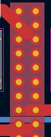
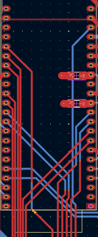
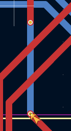
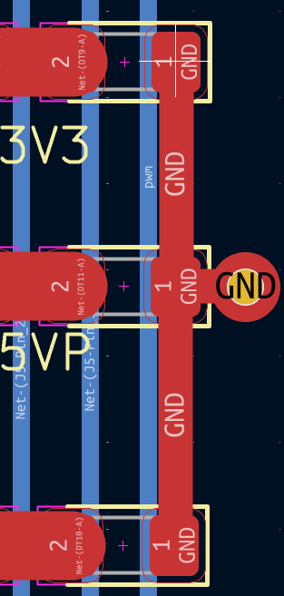
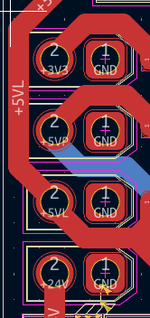
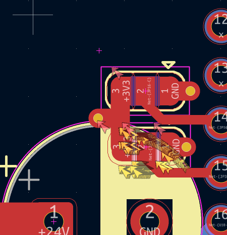
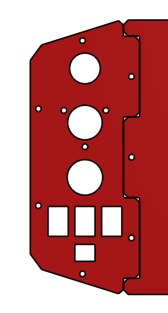
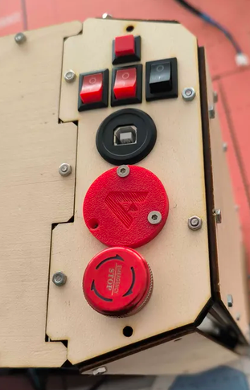
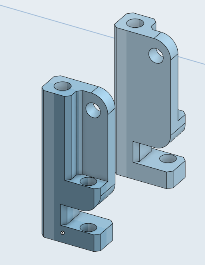

# confirmer carte
- au lieu faire des routes de 8mm faire des zones avec plein de via 
### 
- mettre les bon pin pour l'esp / step, dir 
### 
- ne jamais mettre 2 via sur la meme route 
### 
- préférer metre un via proche plutot que de relier avec route elle meme reliée a via 
### 
- quand les routes s'entremèllent on peut parfois tourner le tout 
### 
- ne pas mettre des bumper sur trace de la carte 
### 
- mettre toutes les empruntes a la grille 
- si éléments se répèttent mettre tout (routes) dans le meme sens bien aligner

# modelisation 3D
## infos entrée

### j'ai intégrer l'enssemble des infos d'entree :
- 3 switch
- 1 bouton
- 1 BAU
- 1 tirette
- 1 connecteur usb
###   

## compartiment carte
### fair la meme chause qu'avec la batterie pour la carte elec
### problème pour le grall coté pas lisse
### pratique pour modif / regarder l'élec
### possibilité de juste faire un tiroire mais caché deriere la plaque principale pleine (on dévice la plque pendant les teste et on la remet lors des match)
### fait ça c'est bien
### 
### voila !
### le support repose sur un point d'accroche de chaque coté permettant de faire pivoter l'enssemble de la carte pour bloquer la carte a l'horizontal, on met une visse dans le second trou et cela vien en buté contre une 3e visse qui elle était sur la makerbim
### je pense que la carte sera trop fragile pour tenir sans fléchir, je pense donc qu'une armature a l'arière de la carte sera utile. ainsi la carte cera entièrement stable.
### il manque aussi un moyen d'arreter la carte quand elle est a la verticale

### cela permet d'agir sur le programme du robot, le but du positionement est de placer l'enssemble de manière accessible et optimiser. les switch sont cote cote et permettent de choisir la stratégie du robot, le BAU est a l'une des extrémitée pour etre le plus acessible possible, sur l'un des coté, on est pas dérangé par le mat du lidar cela permet donc a l'arbitre de l'apuiller simplement. la tirrette est a coté du BAU car c'est la deuxieme chause qu'on touche après avoir allumer le robot , elle permet d'activer le robot avec un aimant. le connecteur usb est au centre car c'est celui dont on a le moin besoin d'accéder en match, il permet de se brancher directement sur l'espp sans avoir a tirer un cable depuis le port usb de l'ESP. enfin de bouton permet soit delancer l'initialisationn du robot soit de séléctionner des choses sur l'écran au chois.

### j'ai placer les éléments sur onshape en fesant la modélisation 3D de la plaque et en ajoutant des trous aux bonnes dimmentions pour chaqu'un des éléments. enfin j'ai exporté en dxf puis découpé a la découpeuse laser la plaque dans du bois de 3mm

# fun fact
### au lieu faire des routes de 8mm fait des zones, pareil quand il des petites route qui font des ziguigui partout des que il y a plusieurs pins raprochés en générale on met une zone. Si on fait passer beaucoup de puissance, on met des via partout et on duplique la zone dans la couche inf