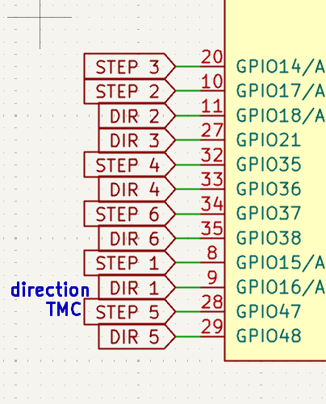
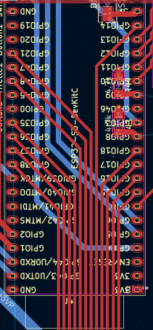
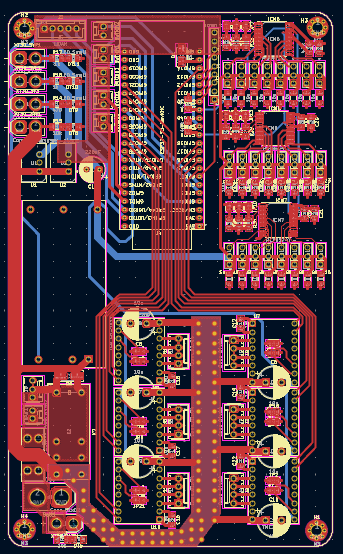
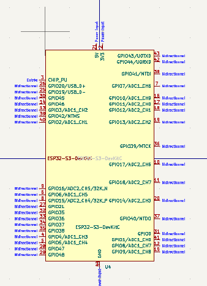
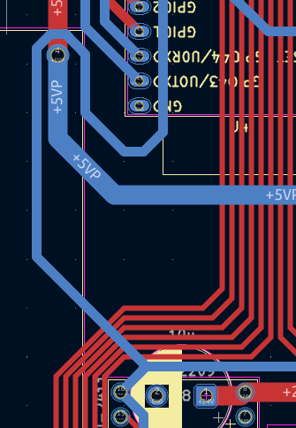

# carte élec
### j'ai mis les pins dans le bon ordre pour avoir aucun croisement et ça rend bien.
### 

### j'ai aussi relierles dernier élément comme ecrans, sda scl, tirette boutton ..., Eneble.

### 
### victoire !!! (jai pas encore verif avec alban)
### j'ai demandé a alban c'est pas fini j'ai des truc a faire :=(
### 
### j'ai modif tous les pins pour que cela arrive de manière logique sur le routage

## ce dont je ne suis pas trop content
- le détoure du enable n'est pas beau 
### 
- sda scl fait un détoure chelou

# module devkit c1
## y a t'il de pins spi non utilisable ?
### non après avoir regarder la datasheet, les pins 27 a 35 sont utiliser pour la psram/ quad spi flash, mais ils ne sont pas connecter au pins du module donc pas d'inquiétude 
### chill

## fun fact
### dans le module Esp il y a le vrais composant esp ainsi que des composants basique qui permettent de faire fonctionner le composant esp, le module contien aussi une antenne et un blindage pour les composants afin d'empecher le cristal de ce prendre les rayonnement de l'entaine.
### le composant de base esp a plein de pin gpio, usb, gnd, 3v3 ... ainsi que une certaine quantitée de mémoire ram et flash. Si on en veux plus, on doit utiliser des pin (gpio) pour en ajouter par exemle sur le devkit, on utilise : 
- sck = clok
- sdi = com
- sdo = com
- sc = select
### comme on utilise ces pin pour ajouter de la mémoire on ne peut pas les utiliser pour autre chose sans modifier la mémoire flsh/ram, sur le devkit ils ne sont pas relier au pins externes

# fun fact
### les via c'est en 0.7, 0.4 !
