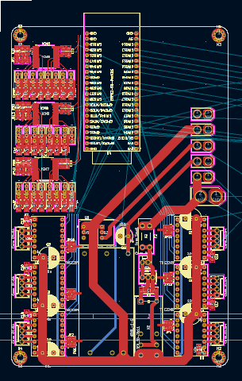

 
## Carte élec :
- mon début de carte a des boucle + pistes trop longue.
- servo correcte ne pas refaire.
- attention manque un condo de découplage sur servo

- possible mettre puissance et tmc sur une couche, coller tmc coté conn, faire passer alim au milieu et mettre puissance bat a coté.

- modif pin de l'esp pour tout metre facilement sur le routage

## truc intéressant :
- carte multi couche  
 . mettre les signaux sur les couches externes et la puissance a l'intérireure, avec gnd au cul de la couche signal la plus importante.
 . si besoin de piste plus fine peut doubler piste sur deux couche de la carte ! la bombarder de via ! 
 . possible de mettre des composants au milieu
 . possible de mettre des couche vide pour faire passer du liquide a l'intérieur

- revetement de carte: 
(j'ai oublié les noms)
. plaqué or 

. on met de l'éteint partout puis on le fix aux endroits souhaités et enfin on viens soufler le sur plus